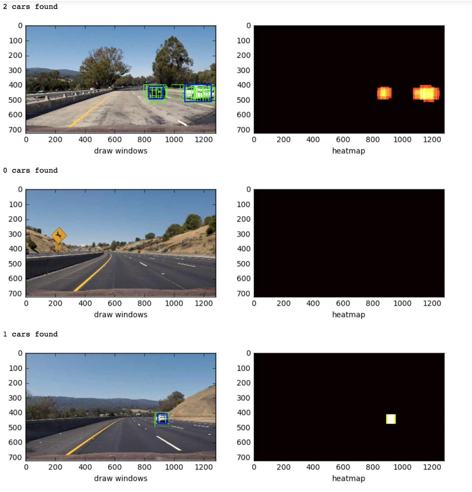

# Vehicle Detection

---

The goals / steps of this project are the following:

* Perform a Histogram of Oriented Gradients (HOG) feature extraction on a labeled training set of images and train a classifier Linear SVM classifier
* Optionally, you can also apply a color transform and append binned color features, as well as histograms of color, to your HOG feature vector. 
* Note: for those first two steps don't forget to normalize your features and randomize a selection for training and testing.
* Implement a sliding-window technique and use your trained classifier to search for vehicles in images.
* Run your pipeline on a video stream (start with the test_video.mp4 and later implement on full project_video.mp4) and create a heat map of recurring detections frame by frame to reject outliers and follow detected vehicles.
* Estimate a bounding box for vehicles detected.

###Decide what Features to extract from Images  
I tried to use YUV color space to extract color histogram features, spatially binned features and HOG features

Car:
  

Non_car:
  

As you can see the HOG features is the easiest features to tell if the object is a car or not. So I decide to extract HOG features only from each frame.

###Histogram of Oriented Gradients (HOG)

####1. How to extract HOG features from the training images.

The function `get_files()` (In[5] in p5.ipynb) is used for collecting all PNG files full path in `vehicle` and `non-vehicle` directories.

Then I read the image data by using the function `mpimg.imread(png_file, format="uint8")` (In[9] in p5.ipynb).

The function `extract_features()`(In[5] in p5.ipynb) is for convert the image data from RGB to YUV then use `skimage.hog()` with parameters:`orientations=8`, `pixels_per_cell=(8, 8)`, `cells_per_block=(2, 2)` to generate HOG data from Y, U, V channels separately.

Car HOG:  
  
Non_Car HOG:  
  

I used all three channels (Y-HOG,U-HOG, V-HOG) as the training features. After getting the training data I used `sklearn.preprocessing.StandardScaler()` to normalize the data. (In[7] in p5.ipynb)


####2. How to train a classifier using the selected HOG features  
I used the function `sklearn.model_selection.train_test_split()` to split
the featues and labels into training and test set. (In[8] in p5.ipynb)

label length: 17760  
feature lenght: 17760   
train label length: 14208.  
train feature lenght: 14208.   
test label length: 3552.   
test feature lenght: 3552.   
num of features: 4704    

Then I choose Linear SVM as classifier and use all default parameters. (In[11] in p5.ipynb) And Test Accuracy of LinearSVC is 0.9865.


###Sliding Window Search

####1.How to implement a sliding window search.  

I use the function `slide_window(img, x_start_stop=[None, None], y_start_stop=[None, None],  xy_window=(64, 64), xy_overlap=(0.8, 0.8)` (In[14] in p5.ipynb) to generate a list of bounding boxes for the search windows.

Then I have another function `get_roi_windows(roi, img)` to decide the ROI and feed the arguments to `slide_window()` to create the final searching windows positions.

```python  
# Format:
# [x_start, x_stop], [y_start, y_stop],(window_size)
roi = [([400, 500], [600, 1280], (64, 64)),
       ([400, 500], [640, 1280], (96, 96)),
       ([400, 500], [640, 1280], (128, 128))]
```
As you can see I setup three main ROIs.
The window sizes are 64x64, 96x96 and 128x128. Overlap is 80%.
  

####2. How to Find Cars by Using Sliding Window Search

Please see the function `search_windows()` (In[16])  

1. Use sliding windows to get the ROI that needs to be analyzed.  
2. Convert sliding window image from RGB(uint8) to YUV. 
3. Extract HOG fetrues from thoese 3 channels (YUV). 
4. Send those features to classifier to check the   prediction value
5. Save the window position if prediction is True  


####3. Multiple Detections & False Positives
As you can see from the screenshot shown above there are several windows on each car. And sometimes there might be some windows located in a Non-Car position.  
So I implement the heatmap to figure out this issue.  
The function `get_heatmap(img, bbox_list, thresh=5)` (In[50]) is to collect all detected windows and add "heat" (+=1) for all pixels within those detected windows. The return a list of bounding boxes.  
The "hot" parts of the map are where the cars are, and by imposing a threshold, you can reject areas affected by false positives.  
After getting heatmap, use `scipy.ndimage.measurements.label(heatmap)` to get final bounding boxes for detected cars.  


*The green windows are the original detected windows  
*Blue windows is the one created by using heatmap


---

### Video Implementation

Here's a [link to my video result](output_images/project_video_result.mp4)

For smoothing the windows I use `deque(maxlen=4)` to store the heatmap data from previous three frames. (In[65] in p5.ipynb). I integrated heatmap from Four frames and get a better fit window.


---

###Discussion
1. I still see some false positive windows showed in some frames. I can tune my Classfier and the threshold number in the heatmap implementation.
2. I only use HOG as the traning feature. Becasue I did try other features but always cause over-fitted probelem.


